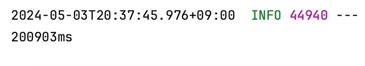

## Virtual Threads
Java 가상 스레드는 Java 21에 정식 포함된 기능이다. Project Loom에서 개발되었고, **스레드 관리를 JVM 수준에서 가능**하게 해준다.

Java 가상 스레드와 비슷한 개념들은 이미 존재했고 상용화가 되어있다. 
- Kotlin Coroutine
- Go Gorouine

기존(전통)의 주로 사용되는 Java 스레드 모델은 요청당 하나의 스레드를 갖고, 
커널 스레드(os 수준)와 직접 맵핑(1 : 1)되어 코드의 전체 수명 동안 os 스레드를 캡쳐(랩핑) = 플랫폼스레드)해서 사용되는 구조였다.

해당 구조에는 문제가 많은데 웹 애플리케이션 개발 시 사용자 작업을 스레드에서 처리해야하는데,
스레드 생성 및 삭제 비용이 커지게 되어 부담이 많았다.

이를 해결하기 위해 나온 개념은 **스레드 풀**이다.

스레드 풀은 사용할 스레드의 개수만큼 미리 생성하여 사용할 때 빌려주고 반납하는 메커니즘을 가진다.

이로 인해 스레드를 생성, 삭제하는 비용에 신경쓰지 않을 수 있게 되었다.

하지만, 스레드 풀의 딜레마가 존재하는데 스레드 풀의 스레드 보다 더 많은 요청이 오게되면 그 요청은 스레드가 생길 때까지 무한정 기다려야하는 문제가 있고,
이를 해결하기 위해 스레드 풀의 용량을 늘리면 리소스 사용량이 부담이 많아지는 문제가 발생한다.

그래서 리액티브 프로그래밍과 같은 해결법이 나왔지만, 코드의 작성이 매우 어려웠고 Java 가상 스레드가 나오게 되었다.

Java 가상 스레드란, os에 의해 관리되던 기존 스레드가 가상머신(JVM)에서 자체 스케줄러로 관리하여 자원 소모를 최소화하고 동시성을 향상하는 스레드 모델이다.

Java 런타임에 의해 구현되는 스레드이고, 하드웨어 쪽에 직접 액세스할 수 없다.

또한, 가상 스레드는 데몬 스레드로 요청마다 생성하고 삭제되어. 따로 관리할 필요가 없다.

---

## Code

```java
public void test_single() {
    long start = System.currentTimeMillis();
    try (var executor = Executors.newSingleThreadExecutor()) {
        IntStream.range(0, 100).forEach(i -> {
            executor.submit(() -> {
                Thread.sleep(Duration.ofSeconds(2));
                return null;
            });
        });
    }
    long end = System.currentTimeMillis();
    System.out.println((end - start) + "ms");
}
```
해당 코드는 **싱글 스레드**로 sleep 2초 작업을 100번 실행하는 코드이다.

싱글 스레드로 작동하면 큐 방식(FIFO)으로 작동할 것이기 때문에 대략 200000ms 정도의 성능이 예상된다.


```java
public void test_single() {
    long start = System.currentTimeMillis();
    try (var executor = Executors.newVirtualThreadPerTaskExecutor()) {
        IntStream.range(0, 10_000).forEach(i -> {
            executor.submit(() -> {
                Thread.sleep(Duration.ofSeconds(2));
                return null;
            });
        });
    }
    long end = System.currentTimeMillis();
    System.out.println((end - start) + "ms");
}
```
해당 코드는 **가상 스레드**를 사용해 만개의 sleep 2초 작업을 실행하는 코드이다.

가상 스레드를 거의 무한적으로 생성해 기존 멀티 스레드보다 자원 낭비가 적고 병렬 실행을 기대할 수 있다.


[Java's Virtual Threads - Next Steps](https://www.youtube.com/watch?v=KBW4LbCoo6c&t=1223s)