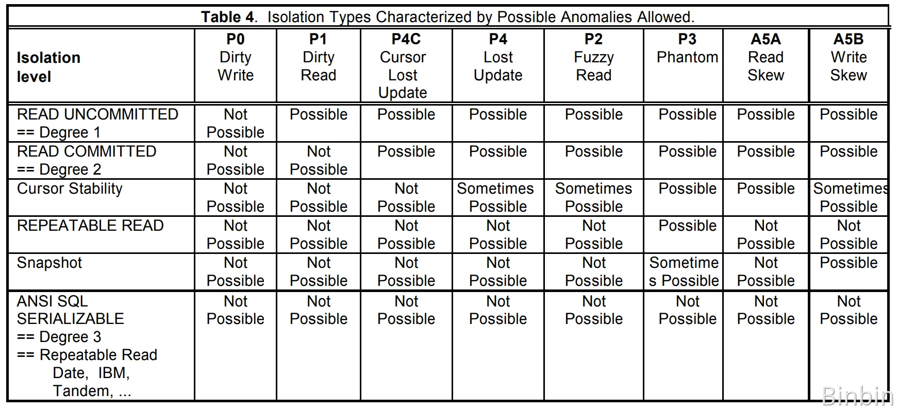

# InnoDB ACID 트랜잭션

트랜잭션은 논리적인 동작을 정해놓은 일련의 작업 모음이다.

InnoDB에서는 ACID라는 특성을 나타내는 트랜잭션을 갖고 있는데,
ACID는 **원자성, 일관성, 격리성, 지속성**을 의미한다.

### A 원자성 
하나의 트랜잭션은 실패하거나 성공한다는 것이다. 
이게 무슨 뜻이냐면, 트랜잭션 내의 두 가지 동작(명령)이 정해져있을 때 무조건 둘 다 성공을 해야지 성공이라는 것이다.
하나의 동작이라도 실패하면 해당 트랜잭션은 실패이다.

### C 일관성
모든 제약 조건과 규칙이 준수되어야한다는 것이다. 송금 예시로 살펴보면, 입금과 출금의 총액이 무조건 일치해야한다는 것이다.

### I 격리성
트랜잭션들 서로 영향을 줄 수 없어야한다는 것이다.

### D 지속성
완료된 트랜잭션은 무조건 영구적으로 반영되어야한다는 것이다. 갑자기 서버의 전원이 꺼져도 완료된 트랜잭션의 데이터 변경 사항은 손실되면 안된다.

# InnoDB 트랜잭션 격리 수준
**격리 수준 ↑ → 데이터 정합성 ↑, 동시성 ↓, 문제 발생 가능성 ↓**

추후 공부해야할 키워드: MVCC, Undo Log

### READ UNCOMMITTED
가장 낮은 격리 수준이고, 다른 트랜잭션의 커밋되지 않은 변경 사항을 읽을 수 있다.

### READ COMMITTED
커밋된 데이터만 읽을 수 있다. 

### REPEATABLE READ (InnoDB 기본값)
동일 트랜잭션 내에서의 조회 결과 일관성 보장한다.

**InnoDB에서는 SQL 표준과 다르게 해당 격리 수준에서 Phantom Read를 방지**한다. (Next-Key Locking, 범위 검색 시 갭 락 추가 적용)

### SERIALIZABLE 
가장 높은 격리 수준으로 모든 읽기 작업에 Shared Lock 설정한다.

트랜잭션이 순차적으로 실행되어 동시성이 저하된다.

## 동시 트랜잭션으로 인해 발생하는 문제 (ANSI SQL, 표준 SQL)
이 부분은 마이크로소프트의 [A Critique of ANSI SQL Isolation Level](https://www.microsoft.com/en-us/research/wp-content/uploads/2016/02/tr-95-51.pdf) 논문을 참고하여 작성되었습니다.!! 🙇‍♂️🙇‍♂️

참고 내용:
- P는 'Problem'을 뜻하고, 기본적인 동시성 문제이다.
- A는 'Anomaly'를 뜻하고, 표준 SQL 격리 수준에서 정의되지 않은 고급 이상 현상이다.
- 숫자가 작을수록 더 기본적이고 심각한 문제이다.
- 숫자 뒤에 붙는 알파벳은 서로 다른 유형의 이상 현상을 구분하기 위함이다.

### P0 Dirty Write
트랜잭션 A와 B가 동일 레코드를 동시에 수정하고, A의 변경이 B의 변경에 의해 묻히는 현상

```
트랜잭션 A가 balance를 100으로 업데이트.

트랜잭션 B가 동시에 balance를 200으로 업데이트.

A가 커밋 전에 B가 커밋하면, A의 변경(100)은 B의 변경(200)에 의해 덮어쓰여진다.
```

### P1 Dirty Read 
트랜잭션 A가 B의 커밋 전 데이터를 읽어 B가 롤백되면 A는 유효하지 않은 데이터를 기반으로 동작하는 문제

```
트랜잭션 A가 balance를 100으로 업데이트 (아직 커밋 X).

트랜잭션 B가 balance를 읽어 100을 얻음.

A가 롤백하면, B는 유효하지 않은 데이터(100)를 사용하게 된다. (B는 잘못된 데이터를 기반으로 동작)
```

### P4C Cursor Lost Update
트랜잭션 A가 커서로 조회한 데이터를 수정 중, 트랜잭션 B가 동일 데이터를 먼저 업데이트하여 A의 변경이 무효화되는 현상

```
트랜잭션 A가 SELECT ... FOR UPDATE로 balance를 읽는다 (현재 값: 100).

트랜잭션 B가 동시에 balance를 200으로 업데이트하고 커밋.

A가 balance를 150으로 업데이트하면, B의 변경(200)은 손실된다.
```

### P4 Lost Update
트랜잭션 A와 B가 동시에 같은 레코드를 읽고 순차적으로 업데이트할 때, 나중 변경이 이전 변경을 덮어씀

```
트랜잭션 A와 B가 동시에 balance를 읽는다. (현재 값: 100).

A가 balance를 150으로 업데이트.

B가 balance를 200으로 업데이트.

A의 변경(150)은 B의 변경(200)에 의해 덮어쓰여진다.
```

### P2 Fuzzy Read, Non-Repeatable Read
트랜잭션 A가 동일 쿼리를 반복 수행할 때, 트랜잭션 B의 커밋된 업데이트/삭제로 인해 결과가 달라지는 현상.

```
트랜잭션 A가 balance를 읽어 100을 얻는다.

트랜잭션 B가 balance를 200으로 업데이트하고 커밋.

A가 다시 balance를 읽으면 200을 얻는다. (동일 트랜잭션 내)
```

### P3 Phantom 
트랜잭션 A가 범위 조건으로 조회한 후, 트랜잭션 B가 해당 범위에 새 레코드를 추가/삭제하여 A의 재조회 시 결과가 변하는 현상

```
트랜잭션 A가 SELECT * FROM accounts WHERE balance > 100을 실행 (결과: 2건).

트랜잭션 B가 balance를 150으로 업데이트하여 조건에 맞는 새 레코드를 추가.

A가 동일 쿼리를 다시 실행하면 3건을 얻는다.
```

### A5A Read Skew
관련 데이터 간 불일치

```
트랜잭션 A가 accounts 테이블에서 balance를 읽음 (계정 X: 100, 계정 Y: 200).

트랜잭션 B가 계정 X의 balance를 150으로 업데이트하고 커밋.

A가 계정 Y의 balance를 다시 읽으면 200을 얻는다. (Y 데이터만 읽고, 현재 트랜젝션의 데이터가 유효하다고 판단할 수 있다. 실제로는 변경된 X 데이터가 반영되어야한다.)
```

### A5B Write Skew 
트랜잭션 A와 B가 서로 다른 레코드를 읽고 논리적 조건에 기반해 업데이트할 때, 전체 제약 조건이 위반되는 현상

```
두 계정(X, Y)의 총합이 300 이상이어야 하는 제약 조건이 있다.

트랜잭션 A가 계정 X의 balance를 100에서 50으로 감소시킨다.

트랜잭션 B가 계정 Y의 balance를 200에서 150으로 감소시킨다.

각 트랜잭션은 독립적으로 제약 조건을 만족하지만, 커밋 후 총합은 200이 되어 제약 조건 위반.
```

---

### 격리 수준에 대한 병행제어 실패 현상




---
https://www.microsoft.com/en-us/research/wp-content/uploads/2016/02/tr-95-51.pdf
