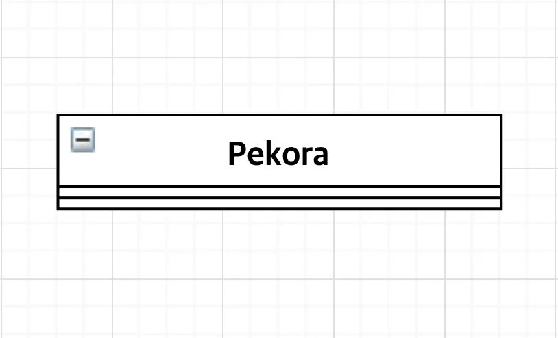
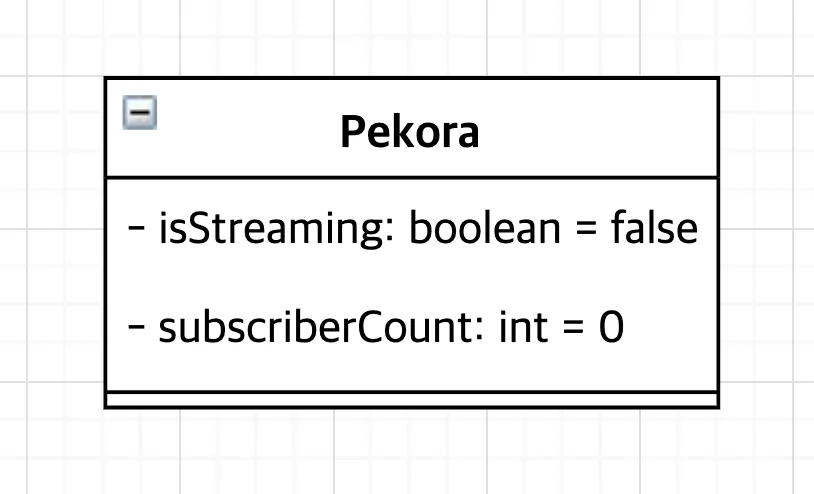
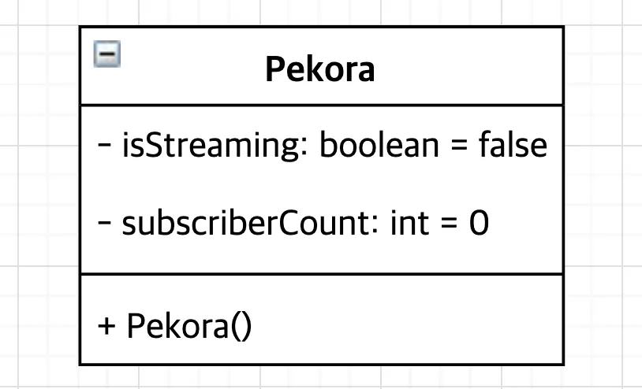
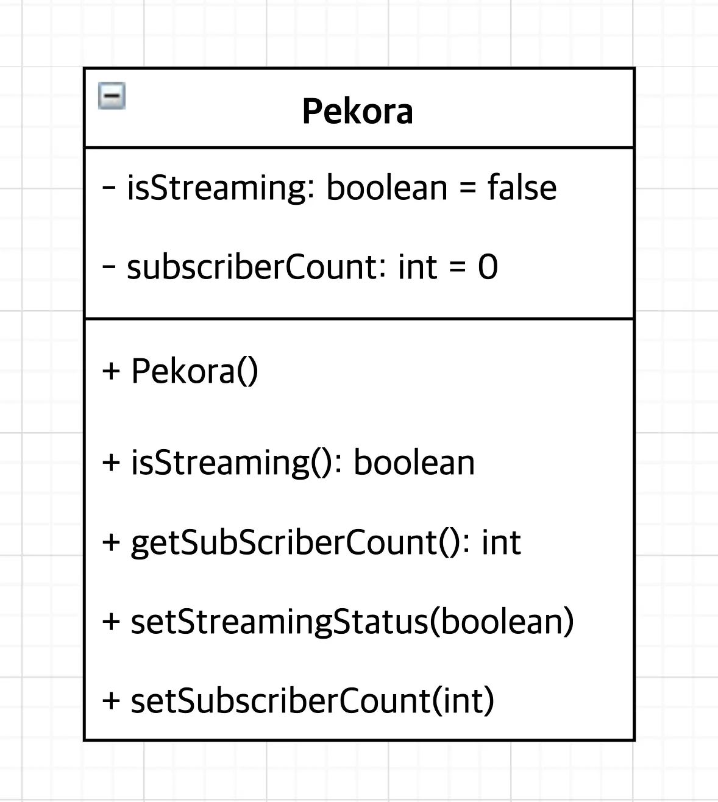
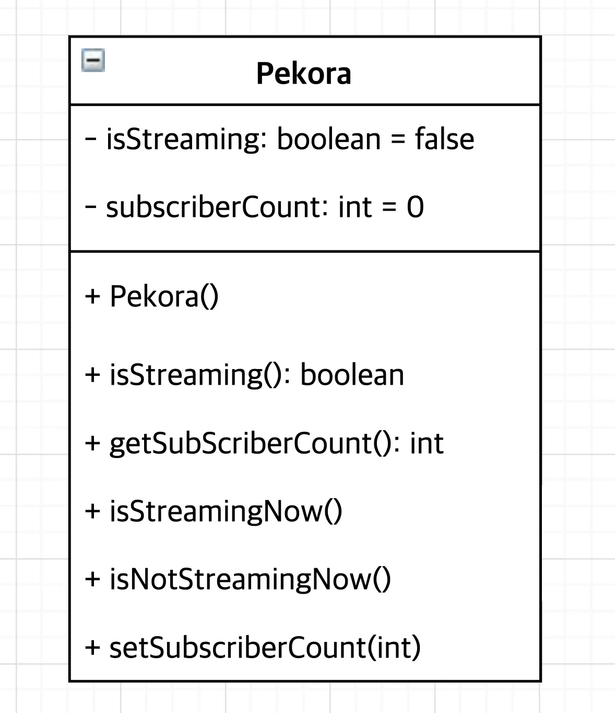

# 간단한 객체 모델링

## 우사다 페코라를 모델링 해보자.

### 클래스 명부터 정하기

클래스 명: `Pekora`

### 객체의 상태 추가

페코라의 상태는

- 현재 라이브 중인가? : isStreaming
- 구독자 수 : subscriberCount

정도로 하자.

### 생성자 추가

클래스로 객체를 생성하려면 생성자가 필요하다.

### 객체의 동작 추가

언제든 객체의 상태를 조회해야하니 getter 추가, 객체 상채를 바꿔줘야하니 setter 추가

동작을 추가하고 고민해 보니까 `setStreamingStatus` 가 boolean을 입력 받으니 true 아니면 false이다.

이걸 입력 받지 않고 다른 동작으로 나눌 수 있지 않을까?

이제 만족한다.